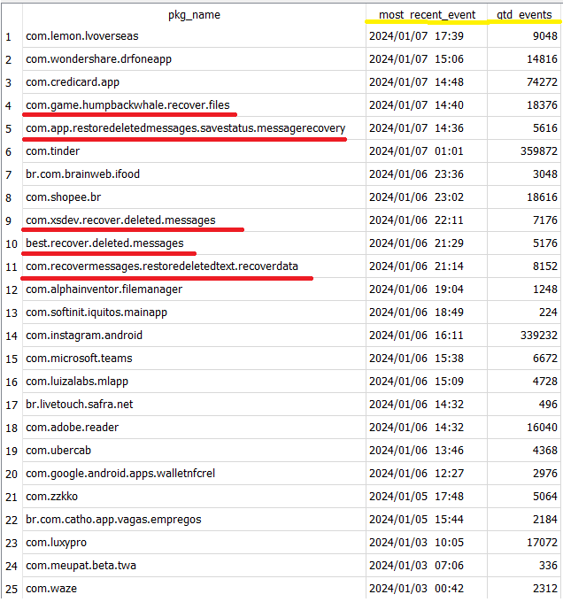
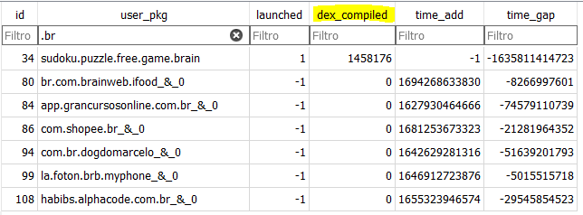
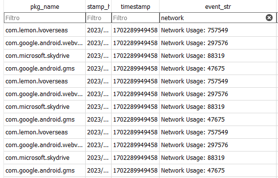

# Towards deleted app analysis for Android
#### Processes Android ZIP extraction or folder
```
# folder
python main.py -extraction .\input\ -out output
# zip and overwrite output dir
python main.py -extraction .\input.zip -out output --force
```

```
usage: main.py [-h] [--debug] [-extraction EXTRACTION] [-temp TEMP_DIR]
               [-out OUT_DIR] [--force]

Start Android App Analysis

options:
  -h, --help            show this help message and exit
  --debug               Run in debug mode (dump debug messages).
  -extraction EXTRACTION
                        The extraction. A zip file or a folder that contains the extracted android files
  -temp TEMP_DIR        The temp dir to use for temporary files
  -out OUT_DIR          The output dir to use for the database report
  --force               Overwrite output dir. All existing files will be destroyed.

Process finished with exit code 0
```

## Motivation

Once installed, the app may produce many traces in the device.
The idea is to consolidate events captured from many sources and produce a final SQLite database that may be used as a timeline.
The following image shows only deleted apps that were used in failed lost files recovery attempts. 
You can see that so many apps were installed in the device and are not present anymore.
The following next two images show that many information came from different sources, such as the ART JIT pkg prediction and dex optimization and also from the network usage log.

 






